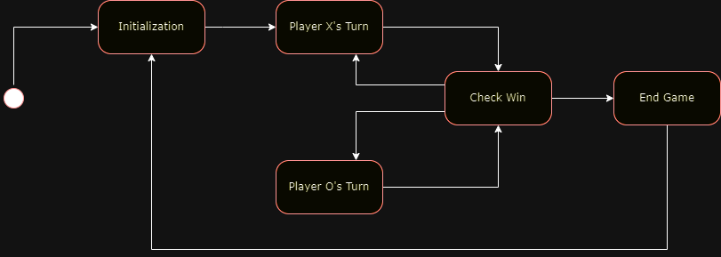

# Tic-Tac-Toe Game in C

## Table of Contents
1. [Introduction](#introduction)
2. [Installation](#installation)
3. [How to Play](#how-to-play)
4. [Features](#features)
5. [State Machine](#state-machine)
6. [Code Structure](#code-structure)
7. [Architecture](#architecture)

## Introduction
A simple Tic-Tac-Toe game implemented in C language.
The game allows 2 players to take turns and compete againts each other in classic Tic-Tac-Toe.
Both players play in the same device.

## Installation
TBD

## How to Play
TBD

## Features
### Board Representation
Game board and ruler.
A 3x3 grid to represent the game board.
A ruler on the perimeter of the board. The ruler indicates the row & column.
Cells can be occupied by "X", "O", or be empty.

### Player Turn
2 players: one is "X", the other is "O".
The game start with player "X", and they take turns.

### User Input
Allows player to select a cell to place their symbol by inputting the coordinates in text.
Player cannot input illegal or occupied cells.

### Game Status
TBD

### Winning Conditions
TBD

### Draw Condition
TBD

### Restart Option
TBD

## State Machine
### List of States
#### Initialization
Set up the game and establish the starting conditions.
Welcome the players & provide brief overview of the game.
Display the game board & current scores.

#### Player X's Turn
Allow Player X to interact with the game board by choosing a row & column to place their 'X' marker.
Update the game board by placing an 'X' in the chosen row & column.

#### Player O's Turn
Exactly the same as "Player X's Turn" state, but the 2nd player & with 'O' marker.

#### Check Win
Assess the current game board to determine if there is a winner or if a draw condition has been met after a player's turn.

#### End Game
Conclude the game by displaying the result, whether it's a win for a player or a draw.
Ask players if they want to play another round or exit the game.

### Transitions

## Code Structure
ST_Tic-Tac-Toe
|-- src/
|   |-- main.c
|   |-- state_machine.c
|   |-- game_logic.c
|   |-- render.c
|   |-- user_input.c
|-- include/
|   |-- state_machine.h
|   |-- game_logic.h
|   |-- render.h
|   |-- user_input.h

## Architecture
TBD, likely Event-Driven State Machine Architecture